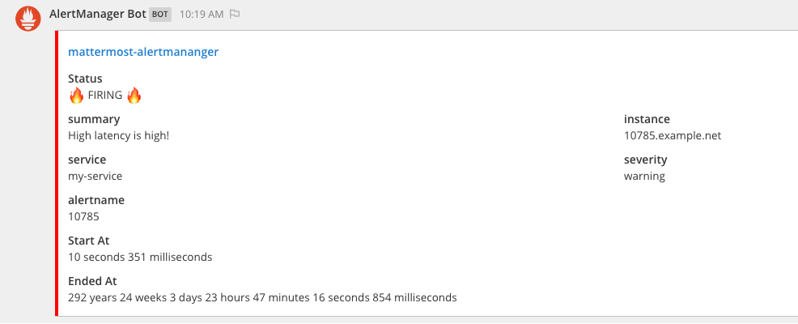
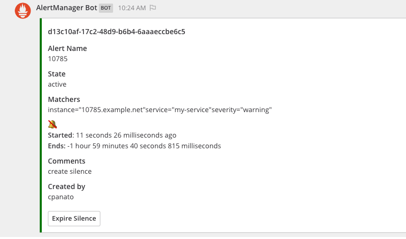
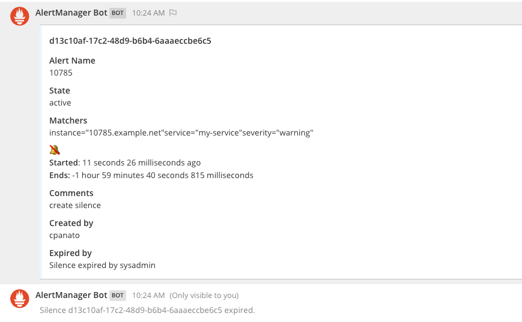

# AlertManager Plugin

This plugin is the [AlertManager](https://github.com/prometheus/alertmanager) bot for Mattermost.

Forked and inspired on https://github.com/metalmatze/alertmanager-bot the alertmanager for Telegram. Thanks so much [@metalmatze](https://github.com/metalmatze/)

Some features:
--------------
 - Receive the Alerts via webhook
 - Can list existing alerts
 - Can list existing silences
 - Can expire a silence

TODO:
-----
  - Create silences
  - Create alerts
  - List expired silences
  - Create and use a bot account
  - Allow multiple webhooks/channels


**Supported Mattermost Server Versions: 5.37+**

## Installation

1. Go to the [releases page of this GitHub repository](https://github.com/cpanato/mattermost-plugin-alertmanager/releases) and download the latest release for your Mattermost server.
2. Upload this file in the Mattermost **System Console > Plugins > Management** page to install the plugin, and enable it. To learn more about how to upload a plugin, [see the documentation](https://docs.mattermost.com/administration/plugins.html#plugin-uploads).

Next, to configure the plugin, follow these steps:

3. After you've uploaded the plugin in **System Console > Plugins > Management**, go to the plugin's settings page at **System Console > Plugins > AlertManager**.
4. Specify the team and channel to send messages to. For each, use the URL of the team or channel instead of their respective display names.
5. Specify the AlertManager Server URL.
6. Generate the Token that will be use to validate the requests.
7. Hit **Save**.
8. Next, copy the **Token** above the **Save** button, which is used to configure the plugin for your AlertManager account.
9. Go to your Alermanager configuration, paste the following webhook URL and specfiy the name of the service and the token you copied in step 9.
10. Invite the `@alertmanagerbot` user to your target team and channel.

```
https://SITEURL/plugins/alertmanager/api/webhook?token=TOKEN
```
Sometimes the token has to be quoted.

Example alertmanager config:

```yaml
webhook_configs:
  - send_resolved: true
    url: "https://mattermost.example.org/plugins/alertmanager/api/webhook?token='xxxxxxxxxxxxxxxxxxx-yyyyyyy'"
```


## Plugin in Action

# 
# 
# 
